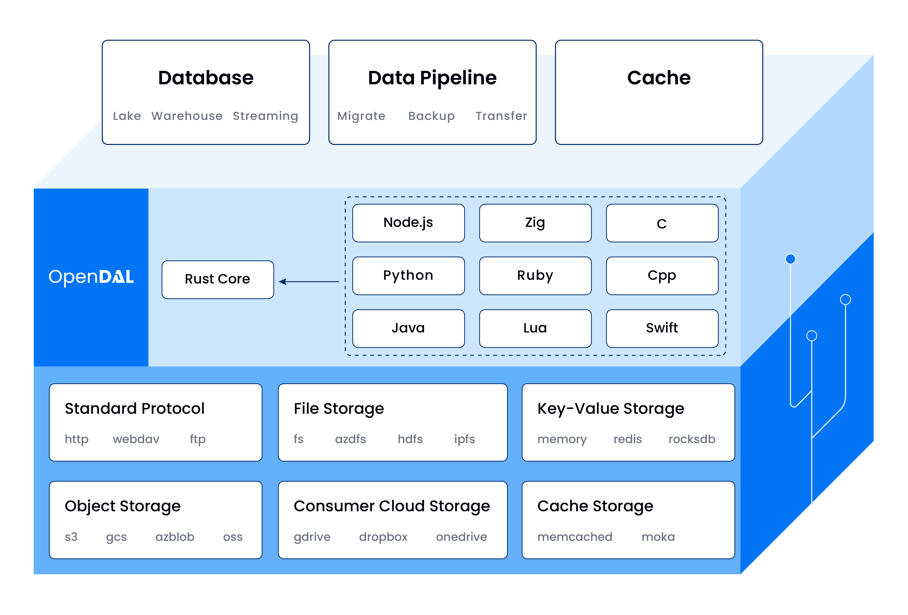

+++
title = "Apache OpenDAL (Incubating) ：无痛数据访问新体验"
description = "介绍 Apache OpenDAL 的定位、优势、使用场景与未来规划。"
date = 2023-07-05
slug = "apache-opendal"

[taxonomies]
tags = ["2023", "ASF", "OpenDAL"]

[extra]
lang = "zh"
+++

> 本文主要根据 [面向 Java 用户的介绍 | @Xuanwo](https://note.xuanwo.io/#/page/opendal%2F%E9%9D%A2%E5%90%91%20java%20%E7%94%A8%E6%88%B7%E7%9A%84%E4%BB%8B%E7%BB%8D) 整理而来。

如果你致力于构建云原生、跨云优先的应用程序及服务，或者希望支持可配置的存储后端以满足复杂的数据访问需要，再或者，你厌倦了在各种 SDK 中进行周旋并期待一个统一的抽象与开发体验，Apache OpenDAL (Incubating) 将会是你的绝佳拍档。



## OpenDAL 是什么

OpenDAL 是一个数据访问层，允许用户以统一的方式轻松有效地从各种存储服务中检索数据。

**数据访问层** 意味着：OpenDAL 在数据读写流程中处于一个 **承上启下** 的关键位置，我们屏蔽了不同存储后端的实现细节，对外提供了一套统一的接口抽象。

接下来，让我们试着回答「OpenDAL 不是什么」，从另一个角度来解构 OpenDAL ：

### OpenDAL 不是代理服务

OpenDAL 以库的形式提供，而并非代理各种存储后端的服务或应用。

如果你希望将 OpenDAL 集成到现有项目中，需要通过 OpenDAL 支持的语言来调用 OpenDAL 的接口直接访问存储服务。

### OpenDAL 不是 SDK 聚合器

尽管 OpenDAL 取代了各类 SDK 在应用架构中的生态位，但 OpenDAL 并不是以 SDK 聚合器的形式进行实现。

换句话说，OpenDAL 不是简单的调用各个存储服务的 SDK，我们基于统一的 Rust 核心开发自行实现了各个存储服务的对接，确保抹平服务之间的细节差异。

以 S3 为例，OpenDAL 手动构造 HTTP Request 并解析 HTTP Response，保证所有行为都符合 API 规范并且完全纳入 OpenDAL 的掌控之中。得益于 OpenDAL 以原生形式接管数据访问流程，我们可以轻松为各种存储后端实现统一的重试和日志机制，并确保行为的一致性。

而对于 S3 的兼容服务，由于原生存储服务的限制和 API 实现的差异，兼容程度和行为细节都可能会与 S3 存在差异，比如 OSS 对 Range 的默认实现就需要设置一个独立的 Header 才能确保行为一致。OpenDAL 除了对接原生存储服务之外，也会对兼容性服务进行针对性处理，以确保用户的数据访问体验。

## OpenDAL 的优势

OpenDAL 并不是唯一一个致力于提供数据访问抽象的项目，但相比于其他同类项目，OpenDAL 具有如下优势：

### 丰富的服务支持

- OpenDAL 支持数十种存储服务，覆盖场景全面，支持按需选用：
  - 标准存储协议：FTP，HTTP，SFTP，WebDAV 等
  - 对象存储服务：azblob，gcs，obs，oss，s3 等
  - 文件存储服务：fs, azdfs，hdfs，webhdfs, ipfs 等
  - 消费级存储服务（网盘）：Google Drive，OneDrive，Dropbox 等
  - Key Value 存储服务：Memory，Redis，Rocksdb 等
  - 缓存服务：Ghac，Memcached 等

### 完整的跨语言绑定

- 以 Rust 为核心，OpenDAL 现在提供 Python/Node.js/Java/C 等多个语言的绑定支持，同时也在积极开发其他语言的绑定。
- 跨语言绑定不光为其他语言提供统一的存储访问抽象，设计和实现上也尽可能遵循各种语言约定俗成的命名风格和开发习惯，为快速上手使用铺平道路。

### 强大的中间件支持

- OpenDAL 提供原生的中间件能力，主要包括
  - 错误重试：OpenDAL 支持细粒度的错误重试能力，除了常见的请求重试之外，支持从断点续传，不需要重新读取整个文件。
  - 可观测性支持：OpenDAL 对所有操作都实现了 logging，tracing，metrics 支持，开启中间件就能直接获得对存储的可观测性能力。
  - 此外还有并发控制，流控，模糊测试等。

### 简单易用

- OpenDAL 的 API 经过良好的设计并在实际使用中不断打磨，文档覆盖全面，方便快速上手。下面是一个使用 Python 绑定访问 HDFS 的例子：

    ```python
    import opendal

    op = opendal.Operator("hdfs", name_node="hdfs://192.16.8.10.103")
    op.read("path/to/file")
    ```

### OpenDAL 的使用场景

目前 OpenDAL 被广泛应用于有云原生需要的各种场景，包括但不限于数据库、数据管道和缓存等，主要用户案例包括：

- Databend：OLAP 云原生数据仓库，使用 OpenDAL 来读写持久化数据（s3，azblob，gcs，hdfs 等）和缓存数据（fs，redis，rocksdb，moka 等）
- GreptimeDB：云原生时序数据库，使用 OpenDAL 来读写持久化数据（s3，azblob 等）
- RisingWave：用于流处理的分布式 SQL 数据库，使用 OpenDAL 来读写持久化数据 （s3，azblob，hdfs 等）
- Vector: 可观察性数据管道，使用 OpenDAL 来写入持久化数据（目前以 hdfs 的使用为主）
- Sccache：支持云存储的类 ccache 工具，主要用于缓存 rust/cpp 语言的编译产物，使用 OpenDAL 来读写缓存数据（s3 和 ghac 等）

## OpenDAL 的未来规划

除了进一步满足云原生数据访问需求之外，OpenDAL 将会持续拓展用户场景，积极探索在数据科学、移动应用等方面的使用。同时，OpenDAL 也会持续打磨现有的实现和绑定，为用户提供更好的集成体验。

OpenDAL 还将会探索如何改善用户在数据管理和服务集成的工作流：

- 打磨 oli 命令行工具，帮助用户无痛管理数据。
- 实现 oay 代理服务，为用户提供高质量的兼容 API 。

另外，由于 OpenDAL 目前是一个跨多语言的项目，我们还计划撰写一系列入门教程，帮助大家从 0 开始，在学习语言的同时掌握 OpenDAL 的使用技巧。

## 致谢

- [Apache OpenDAL(Incubating) | Website](https://opendal.apache.org/)
- [apache/incubator-opendal | GitHub](https://github.com/apache/incubator-opendal)
- [面向 Java 用户的介绍 | @Xuanwo](https://note.xuanwo.io/#/page/opendal%2F%E9%9D%A2%E5%90%91%20java%20%E7%94%A8%E6%88%B7%E7%9A%84%E4%BB%8B%E7%BB%8D)
