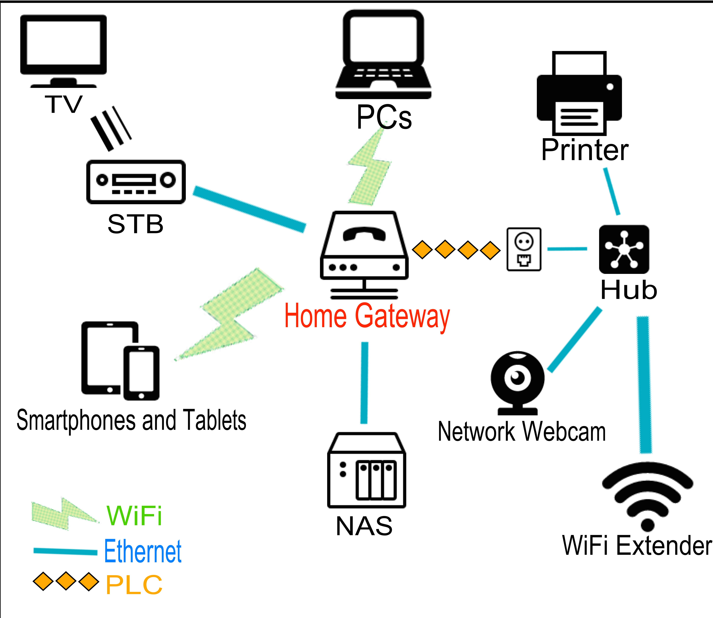
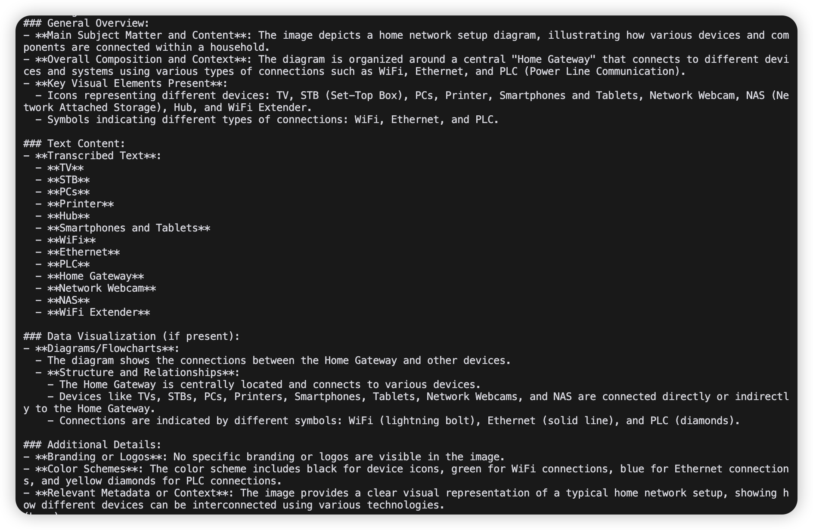

+++
title = "A Dead Simple Way to VLM Parsing"
description = "Learn how to use Visual Language Models (VLMs) to parse unstructured data from images and other media in a straightforward way."
date = 2024-11-28
slug = "a-dead-simple-way-to-vlm-parsing"

[taxonomies]
tags = ["VLM", "Parsing", "OpenAI", "Unstructured Data", "MultiModal", "llama-index", "Python"]

[extra]
lang = "en"
+++

This post demonstrates a straightforward approach to using VLMs for parsing unstructured data from images. While simple, this method can be easily extended to handle more complex scenarios, such as extracting information from PDFs. If you want, you can built a more complex parser as [llamaparse](https://www.llamaindex.ai/llamaparse) with more steps, like OCR, table parsing, etc.

Let's consider a common scenario: you have a collection of images and need to extract text from them. Or perhaps you want to generate descriptions from pictures to enable full-text search capabilities. It's time to hire a VLM (Visual Language Models or MultiModal Models) to work for you.

Since I work extensively with [llama-index](https://github.com/run-llama/llama-index), I'll be using it in the examples. However, the core concepts remain the same, and you can adapt them to work with any tools or clients of your choice.

## Show Me The Code

At first, we need to define a prompt for the VLM to follow, to help it understand what we need.

```python
BASIC_PROMPT = """
        Please analyze this image comprehensively and provide the following information:

        1. General Overview:
           - Main subject matter and content
           - Overall composition and context
           - Key visual elements present

        2. Text Content:
           - Transcribe any visible text accurately
           - Include headers, labels, and captions
           - Note any important text formatting or emphasis

        3. Data Visualization (if present):
           - For tables:
             * Convert to markdown format
             * Preserve column headers and data relationships
           - For charts/graphs:
             * Describe the type of visualization
             * Explain key trends and patterns
             * List important data points and values
           - For diagrams/flowcharts:
             * Explain the structure and relationships
             * Describe the flow or process
             * Note any important symbols or annotations

        4. Additional Details:
           - Identify any branding or logos
           - Note color schemes if significant
           - Describe any relevant metadata or context

        Please format the response clearly and maintain the original structure of any data.
        """
```

Let's build a minimal but functional image parser:

```python
from pathlib import Path
from typing import List
import base64
from io import BytesIO
from PIL import Image
from llama_index.core.multi_modal_llms import MultiModalLLM
from llama_index.core.multi_modal_llms.generic_utils import ImageDocument

class SimpleImageParser:
    def __init__(self, model: MultiModalLLM):
        self.model = model
        self.prompt = BASIC_PROMPT

    """A simple parser for extracting information from images using VLMs.

    Args:
        model (MultiModalLLM): The multi-modal language model to use for parsing
    """

    def process_image(self, image_path: str) -> str:
        """Convert image to base64 encoding"""
        image = Image.open(image_path)
        buffered = BytesIO()
        image.save(buffered, format="PNG")
        return base64.b64encode(buffered.getvalue()).decode("utf-8")

    async def parse(self, image_path: str) -> str:
        """Parse image content"""
        image_data = self.process_image(image_path)
        image_doc = ImageDocument(
            image_url=f"data:image/jpeg;base64,{image_data}"
        )
        response = await self.model.acomplete(
            prompt=self.prompt,
            image_documents=[image_doc]
        )
        return str(response)
```

The core is, we convert the image to base64 encoding, and then pass it to the VLM.

## Taking It for a Spin

Here's how to use our shiny new parser:

```python
import asyncio
import os
import argparse
from pathlib import Path
from llama_index.multi_modal_llms.openai import OpenAIMultiModal
from dotenv import load_dotenv

load_dotenv()

async def main():
    parser = argparse.ArgumentParser(description="Parse image content")
    parser.add_argument("image_path", type=str, help="Path to the image file")
    args = parser.parse_args()

    image_path = Path(args.image_path)
    if not image_path.exists():
        print(f"Image file does not exist: {image_path}")
        return

    # Initialize the VLM
    model = OpenAIMultiModal(
            model=os.getenv("MULTI_MODAL_LLM_MODEL", "gpt-4o-mini"),
            api_key=os.getenv("MULTI_MODAL_LLM_API_KEY"),
            api_base=os.getenv("MULTI_MODAL_LLM_API_BASE", "https://api.openai.com/v1"),
            max_new_tokens=int(os.getenv("MULTI_MODAL_LLM_MAX_TOKENS", "512")),
            temperature=float(os.getenv("MULTI_MODAL_LLM_TEMPERATURE", "0.7")),
        verbose=os.getenv("MULTI_MODAL_LLM_VERBOSE", "False").lower() == "true",
    )

    # Create our parser
    parser = SimpleImageParser(model)
    # Let's parse an image!
    result = await parser.parse(str(image_path))
    print(result)

if __name__ == "__main__":
    asyncio.run(main())
```

In this snippet, we initialize the VLM, create our parser, and then parse an image.

## Running the Demo

I have a repo for a demo of using VLM to parse images, you can see the [code here](https://github.com/psiace/psiace/tree/main/demo/vlm-parsing).

Just run the script with the image path:

```bash
python basic.py <image_path>
```

The example image is a screenshot of a home gateway, from [Home gateway example](https://commons.wikimedia.org/wiki/File:Home_gateway_example.png):



And the result in terminal is:



## Bonus: Extending the Parser

Here are some practical ways to extend this simple parser:

1. **Format Support**

   - Handle PDFs using tools like `pdf2image`
   - Process videos using `opencv-python` for frame extraction

2. **Output Options**

   - Generate JSON output:
     ```python
     async def parse_to_json(self, image_path: str) -> dict:
         result = await self.parse(image_path)
         # Add your JSON transformation logic here
         return json_result
     ```
   - Create custom templates using Jinja2 or similar

3. **Processing Pipeline**

   - Integrate Tesseract OCR for text extraction
   - Try to support table parsing
   - Implement batch processing with asyncio

4. **Integration Ideas**
   - Connect with llama-index for RAG applications
   - Build automated workflows

## Resources

- [llama-index Documentation](https://docs.llamaindex.ai/)
- [OpenAI](https://platform.openai.com/)
- [PIL (Python Imaging Library)](https://pillow.readthedocs.io/)

---

Thanks for reading! If you have any questions or suggestions, please feel free to leave a comment.
