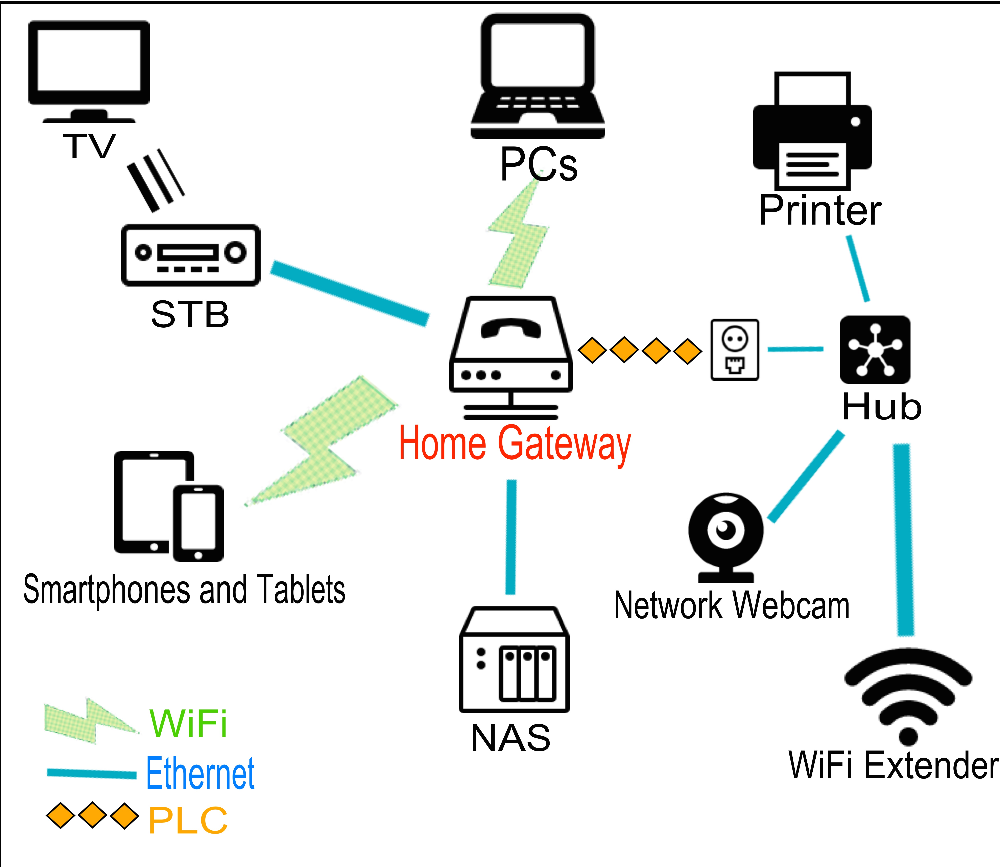
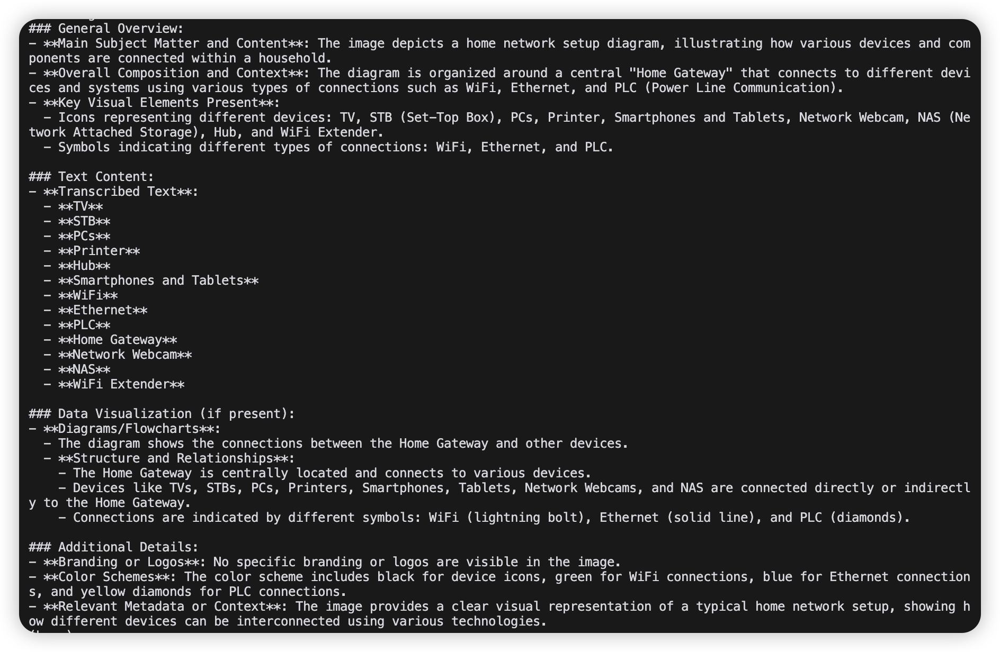

+++
title = "VLM 解析非结构化图像：一个极简可扩展方案"
description = "用一个最小可运行流程，把图片中的非结构化信息交给多模态模型解析，并保留向 PDF、视频和结构化输出扩展的空间。"
date = 2024-11-28
slug = "a-dead-simple-way-to-vlm-parsing"

[taxonomies]
tags = ["VLM", "Parsing", "OpenAI", "Unstructured Data", "MultiModal", "llama-index", "Python"]

[extra]
lang = "zh"
+++

这篇文章展示一种非常直接的做法：用 VLM（Visual Language Models）解析图片中的非结构化信息。

它足够简单，但也保留了明确的扩展路径，比如继续支持 PDF、表格、视频帧等更复杂场景。

如果你想要一条更重型的工业化路线，可以看 [LlamaParse](https://www.llamaindex.ai/llamaparse) 这类产品，它会叠加 OCR、表格解析等更多步骤。

我们先看一个常见场景：你有一批图片，需要抽取文字；或者你想给图片生成可检索描述，用于全文搜索。

这类事情，正适合交给 VLM。

我示例里用的是 [llama_index](https://github.com/run-llama/llama_index)，但核心思路和具体框架无关，迁移到你自己的客户端也很容易。

## 先上代码

第一步是定义一个明确的提示词，让模型知道输出结构和覆盖范围。

```python
BASIC_PROMPT = """
        Please analyze this image comprehensively and provide the following information:

        1. General Overview:
           - Main subject matter and content
           - Overall composition and context
           - Key visual elements present

        2. Text Content:
           - Transcribe any visible text accurately
           - Include headers, labels, and captions
           - Note any important text formatting or emphasis

        3. Data Visualization (if present):
           - For tables:
             * Convert to markdown format
             * Preserve column headers and data relationships
           - For charts/graphs:
             * Describe the type of visualization
             * Explain key trends and patterns
             * List important data points and values
           - For diagrams/flowcharts:
             * Explain the structure and relationships
             * Describe the flow or process
             * Note any important symbols or annotations

        4. Additional Details:
           - Identify any branding or logos
           - Note color schemes if significant
           - Describe any relevant metadata or context

        Please format the response clearly and maintain the original structure of any data.
        """
```

接下来是一个最小可运行的图片解析器：

```python
from pathlib import Path
from typing import List
import base64
from io import BytesIO
from PIL import Image
from llama_index.core.multi_modal_llms import MultiModalLLM
from llama_index.core.multi_modal_llms.generic_utils import ImageDocument


class SimpleImageParser:
    def __init__(self, model: MultiModalLLM):
        self.model = model
        self.prompt = BASIC_PROMPT

    """A simple parser for extracting information from images using VLMs.

    Args:
        model (MultiModalLLM): The multi-modal language model to use for parsing
    """

    def process_image(self, image_path: str) -> str:
        """Convert image to base64 encoding"""
        image = Image.open(image_path)
        buffered = BytesIO()
        image.save(buffered, format="PNG")
        return base64.b64encode(buffered.getvalue()).decode("utf-8")

    async def parse(self, image_path: str) -> str:
        """Parse image content"""
        image_data = self.process_image(image_path)
        image_doc = ImageDocument(
            image_url=f"data:image/jpeg;base64,{image_data}"
        )
        response = await self.model.acomplete(
            prompt=self.prompt,
            image_documents=[image_doc]
        )
        return str(response)
```

核心只有两步：

1. 把图片转成 base64。
2. 作为 `image_documents` 传给 VLM。

## 跑一圈

下面是如何使用这个解析器：

```python
import asyncio
import os
import argparse
from pathlib import Path
from llama_index.multi_modal_llms.openai import OpenAIMultiModal
from dotenv import load_dotenv

load_dotenv()


async def main():
    parser = argparse.ArgumentParser(description="Parse image content")
    parser.add_argument("image_path", type=str, help="Path to the image file")
    args = parser.parse_args()

    image_path = Path(args.image_path)
    if not image_path.exists():
        print(f"Image file does not exist: {image_path}")
        return

    # Initialize the VLM
    model = OpenAIMultiModal(
        model=os.getenv("MULTI_MODAL_LLM_MODEL", "gpt-4o-mini"),
        api_key=os.getenv("MULTI_MODAL_LLM_API_KEY"),
        api_base=os.getenv("MULTI_MODAL_LLM_API_BASE", "https://api.openai.com/v1"),
        max_new_tokens=int(os.getenv("MULTI_MODAL_LLM_MAX_TOKENS", "512")),
        temperature=float(os.getenv("MULTI_MODAL_LLM_TEMPERATURE", "0.7")),
        verbose=os.getenv("MULTI_MODAL_LLM_VERBOSE", "False").lower() == "true",
    )

    # Create parser and parse image
    parser = SimpleImageParser(model)
    result = await parser.parse(str(image_path))
    print(result)


if __name__ == "__main__":
    asyncio.run(main())
```

这段代码会初始化 VLM，创建解析器，然后输出解析结果。

## 运行 Demo

完整示例代码在这里：

- [psiace/demo/vlm-parsing](https://github.com/psiace/psiace/tree/main/demo/vlm-parsing)

运行方式：

```bash
python basic.py <image_path>
```

示例图片是一张家庭网关界面截图（来源：[Home gateway example](https://commons.wikimedia.org/wiki/File:Home_gateway_example.png)）：



终端中的解析输出示例：



## Bonus：如何扩展这个 Parser

下面是几个实用扩展方向：

1. **格式支持**

- 用 `pdf2image` 处理 PDF。
- 用 `opencv-python` 抽取视频帧后再解析。

2. **输出形态**

- 增加 JSON 输出：

```python
async def parse_to_json(self, image_path: str) -> dict:
    result = await self.parse(image_path)
    # Add your JSON transformation logic here
    return json_result
```

- 用 Jinja2 等模板工具生成更稳定的结构化文本。

3. **处理流水线**

- 接入 Tesseract OCR 做文字前处理。
- 追加表格解析能力。
- 用 asyncio 做批处理。

4. **系统集成**

- 接入 llama-index 做 RAG。
- 进一步封装成自动化工作流。

## Resources

- [llama-index Documentation](https://docs.llamaindex.ai/)
- [OpenAI](https://platform.openai.com/)
- [PIL (Python Imaging Library)](https://pillow.readthedocs.io/)

---

如果你只想快速验证“VLM 解析图片”是否有业务价值，这个极简方案足够开始。

先跑通最小闭环，再决定是否引入 OCR、表格结构化和更复杂的工程管线。
