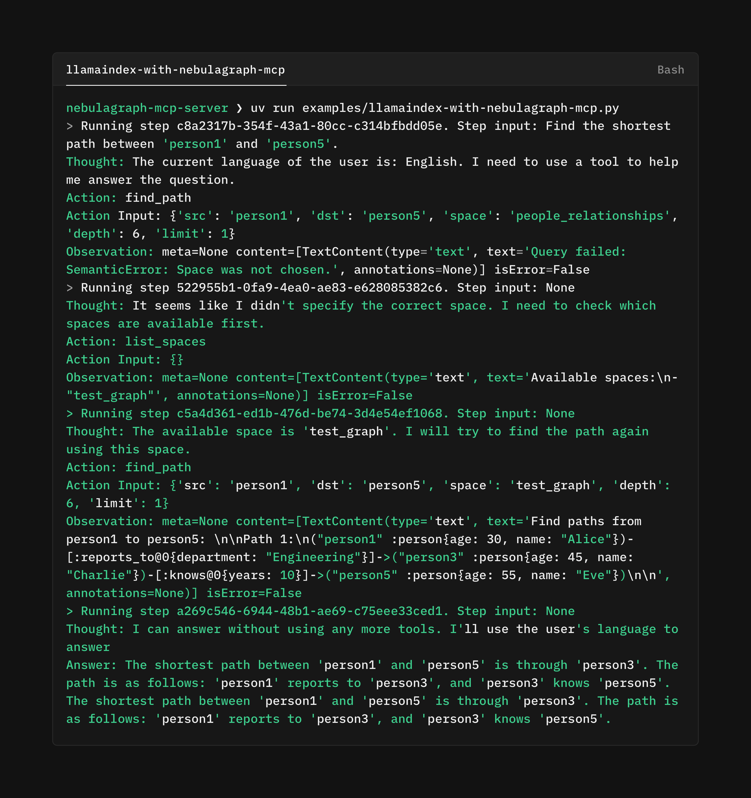

+++
title = "NebulaGraph MCP Server v0.1.0：我们把图数据库接上了 MCP"
description = "一个轻量的 NebulaGraph MCP Server，帮语言模型直接调用图数据库，探索 GraphRAG 的新可能。"
date = 2025-03-11
slug = "announcing-nebulagraph-mcp-server-v010"

[taxonomies]
tags = ["MCP", "LlamaIndex", "Python", "NebulaGraph"]

[extra]
lang = "zh"
+++

## 为什么要做这件事

最近 MCP（Model Context Protocol）社区非常热闹：几乎每天都有新的 MCP Server 诞生，涵盖搜索、数据库、存储、天气等各种领域。我们在做 GraphRAG 和 Agent Workflow 时，需要一种方式，让模型在决策过程中即时获取图数据。因此我基于 NebulaGraph 3.x 写了一个 MCP Server，作为 “NebulaGraph × MCP” 生态的第一块基石。

## MCP 有什么特别

- **统一协议**：把客户端（AI 应用）和服务端（工具/数据源）之间的交互标准化。
- **开放生态**：社区已经有近千个公开实现，可以直接接入。
- **松耦合架构**：开发者可以用同一套协议封装任意后端，接入门槛很低。

对我们来说，MCP 是让 Agent 得以调用图数据库的捷径。

## NebulaGraph MCP Server 做了什么

- 基于 **FastMCP** 实现，支持 `stdio` 和 `SSE` 两种传输模式。
- 暴露了几个基础能力：
  - **列出图空间**：让模型知道有哪些数据域；
  - **查看 Schema**：理解各图空间的点、边定义；
  - **执行 nGQL 查询**：直接跑查询语句；
  - **常用 Operator 模板**：例如最短路径、邻居扩展，封装成可复用工具。
- LlamaIndex 侧通过前文的 `McpToolSpec` 适配器即可直接接入，ReAct Agent 会在推理时自动调用。

示例里我让 Agent 查询某个空间的 schema，再运行路径搜索，结果连同可视化一并返回。

## 下一步

这个版本只是打地基：

- 后续会补充权限控制、查询限流等安全能力；
- 计划支持更多 NebulaGraph 原生特性（如存储过程、图算法库）；
- 与 GraphRAG 管线结合，让模型不仅能查图，还能基于图结构做推理。

仓库在这里：[PsiACE/nebulagraph-mcp-server](https://github.com/PsiACE/nebulagraph-mcp-server)。欢迎感兴趣的同学一起折腾，探讨 AI × 图数据库的更多玩法。EOF
