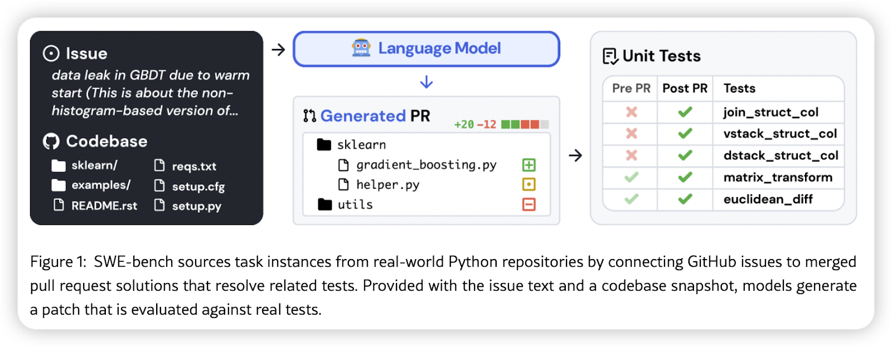
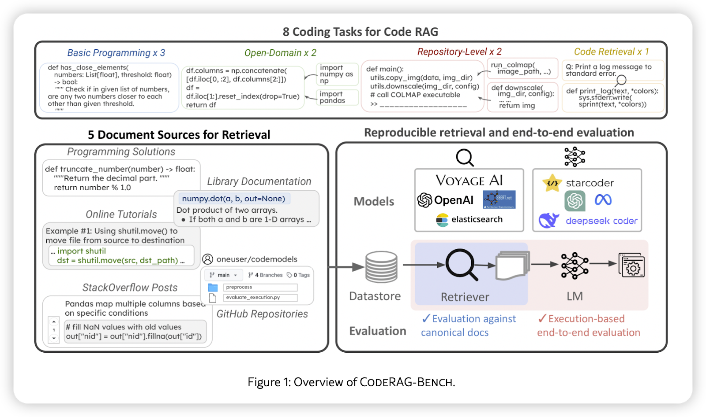
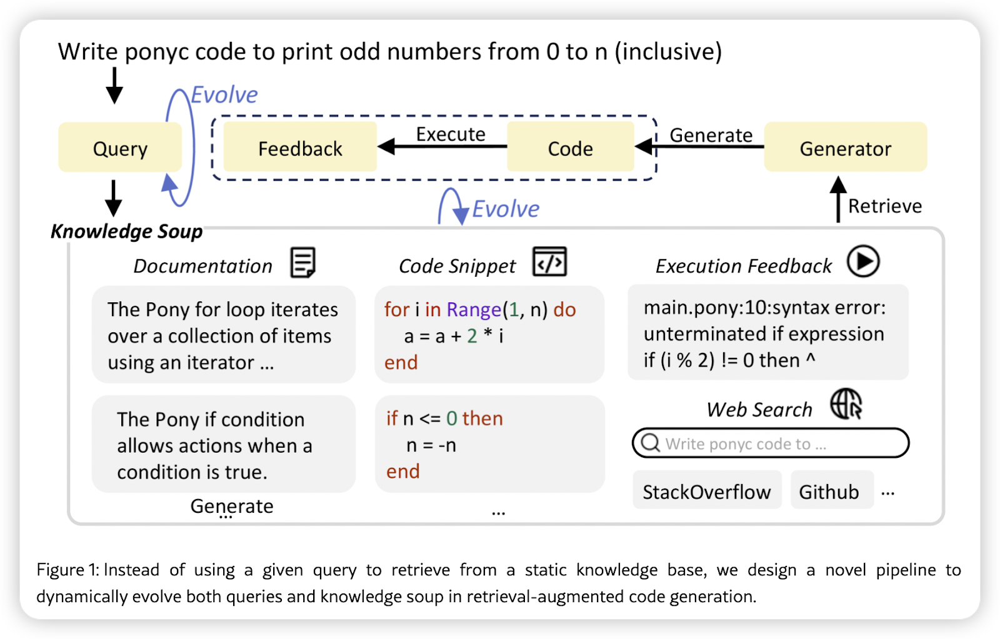
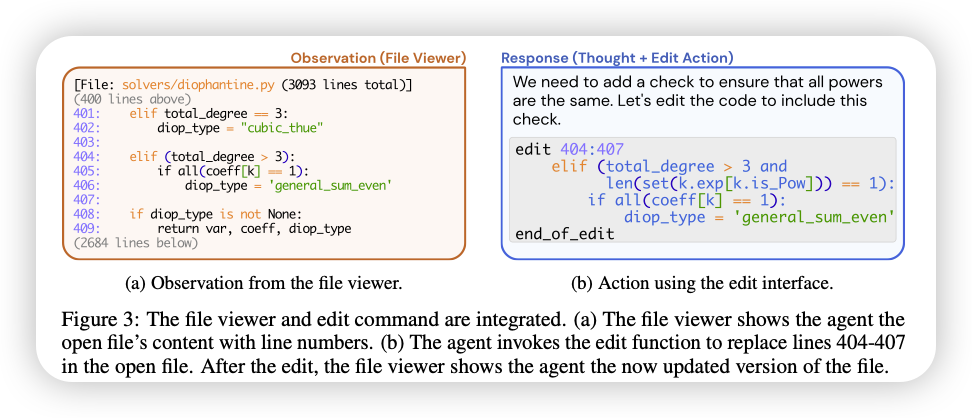

+++
title = "当 RAG 遇上编程助手"
description = "让检索和生成协作，编码助手才能真正懂需求、找资料、写代码、修 bug。"
date = 2025-06-18
slug = "rag-in-coding-agent"

[taxonomies]
tags = ["RAG", "Retrieval", "Agent", "Coding", "Programming"]

[extra]
lang = "zh"
mermaid = true
+++

> 我的日常工作是和 RAG 打交道，最近 Coding Agent 大热，Claude Code 、Cursor 这样的工具已经成为了研发必备的效率神器，于是尝试调研和学习了一下，抛砖引玉。

## TL;DR

Coding Agent 中其实不少环节都可以用到 RAG（检索增强生成），把"查资料"和"写代码"这两件事结合起来。具体来说：

- **理解你想干什么**：分析需求，找到相关代码和文档
- **快速定位文件**：在大项目里找到关键模块
- **写出合适的代码**：基于实际情况和最佳实践
- **帮你调试**：分析错误，搜索解决方案

说白了，就是让编程助手从"代码生成器"变成真正的"软件工程师"。

---

## 写代码的真实痛点

作为一个软件工程师，大部分时间我们都在干这些事：

- 搞懂一个巨大项目是怎么工作的
- 在几百个文件里找到那个该死的模块
- 看着莫名其妙的报错发呆
- 学新框架新工具

这些事情真的很烦，也很费时间。Coding Agent 应该帮我们处理这些重复劳动，让我们可以自由表达自己的想法。假如你的 “编程搭子” 还不够聪明，理解不了你的代码，找不到对的信息，那几乎只会搞砸一切，更别说帮你调试了。

---

## Coding Agent 到底是什么

想象一下，你要做一个从没做过的功能。通常你会这样：

- 先 Google 找例子
- 翻框架文档
- 在自己项目里搜类似的代码
- 上 StackOverflow 看看别人怎么解决的

Coding Agent 就是一个可以自主执行这些动作的智能体，或者说把这个过程自动化了。它不仅可以充当搜索引擎进行学习，还能把找到的信息组合起来，帮你写代码。

原理其实很简单：

1. **检索（Retrieval）**：找相关的东西——代码、文档、问答
2. **生成（Generation）**：用这些信息写出新的代码或解决方案

就这两步，但效果比单纯的代码生成器强多了。

> 当然，为了让一切更加顺利，还需要添加反馈机制。根据调试信息优化并进行修正。

---

## RAG 怎么让编程助手变聪明

结合 RAG，编程助手就能处理我们平时遇到的各种问题了。

整个过程大概是这样的：

### 1. **搞清楚你要干什么**

你说"给 API 加个用户认证"，助手得先理解：

- 要 JWT、OAuth 还是别的方案？
- 现有代码哪里需要改？
- 你用的什么框架？

然后开始工作——去翻文档找例子，把你的需求搞清楚。

### 2. **收集相关资料**

然后就是搜集阶段，像个勤快的实习生一样，到处找：

- **官方文档**：框架的使用指南
- **代码例子**：你项目里或者开源项目的类似实现
- **社区问答**：StackOverflow、GitHub 上的讨论
- **最佳实践**：编码规范和安全建议

把这些都混在一起，就是传说中的"知识汤"。

### 3. **写代码并测试**

有了这些资料，助手就能写出比较靠谱的代码了。但它不会直接给你，而是先在沙箱里跑一遍：

- 看看有没有明显的错误
- 确认确实能解决你的问题
- 有问题的话马上调整

### 4. **处理成功和失败**

代码跑通了当然好，但如果出错了，它不会放弃：

- 分析错误信息
- 去找类似问题的解决方案
- 用新信息再试一遍

这个循环让 Coding Agent 变得靠谱多了。

### 5. **交付成果**

最后，助手会把完整的解决方案给你——不只是代码，还有说明文档。

---

## 最大的坑：什么时候去查资料？

用 RAG 有个很关键的问题：**什么时候该去查资料**？

太早查可能漏掉重要信息，太晚查又会拖慢速度。我觉得这样比较合理：

- 通用的东西（框架文档、编码规范）提前准备好
- 具体问题（调试、特殊需求）现查现用

这样既不会太慢，也不会出错。

---

## 什么信息该存，什么该丢

不是所有信息都一样重要。有些东西（比如框架规则）得一直记着，有些（比如这次运行的日志）用完就可以扔了。

这样处理可能会是一个不错的路线：

| **知识类型** | **怎么存**   | **怎么找**       |
| ------------ | ------------ | ---------------- |
| 编码规范     | 一直存着     | 知识图谱快速查找 |
| 文档教程     | 按版本存     | 语义搜索相关部分 + 代码结构映射 |
| 问答和代码库 | 先临时后永久 | API 查询 + 缓存  |
| 运行时反馈   | 临时存储     | 即时检索和更新   |

这样既不会太慢，也不会占太多空间。

> 执行的上下文越长，无效的信息越多，也需要及时压缩和截断，保留真正有效的部分。

---

## 想试试的话，从简单开始

如果你也想写个编程助手，但不想搞得太复杂，可以这样开始：

1. 先写一些规则和提示词
2. 用简单的搜索工具找文档
3. 写个脚本查 StackOverflow
4. 用 `grep`、`lint` 这些工具收集反馈

这样就有个基础版本了，后面再慢慢改进。

---

## 写在最后

Coding Agent 确实在改变编程的方式。它把"查资料"和"写代码"结合起来，让编程助手真正能帮上忙——理解你的需求、找到相关文件、写出能用的代码、帮你调试问题。

不管你是新手还是老手，这些效率工具总归能让工作轻松一些。如果你想自己搞一个，建议从简单的开始，慢慢试验。反正现在这个领域变化很快，说不定你就能做出下一个爆款工具。

总之，这个方向还是很有意思的，值得关注。
