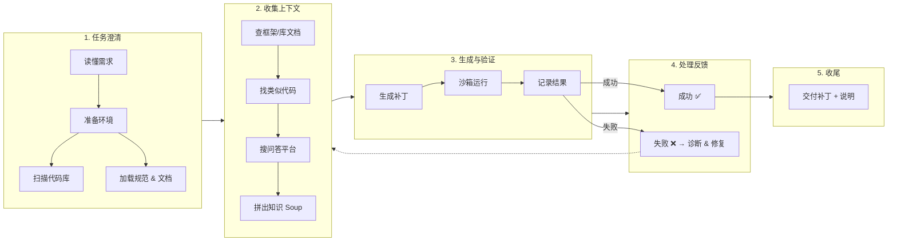

+++
title = "当 RAG 遇上编程助手"
description = "让检索和生成协作，编码助手才能真正懂需求、找资料、写代码、修 bug。"
date = 2025-06-18
slug = "rag-in-coding-agent"

[taxonomies]
tags = ["RAG", "Retrieval", "Agent", "Coding", "Programming"]

[extra]
lang = "zh"
mermaid = true
+++

## 为什么单靠 LLM 不够

写代码最费时的地方不是敲键盘，而是：

- 看懂庞大的旧代码；
- 在仓库里定位相关文件；
- 理解框架的各种约定；
- 排查莫名其妙的错误日志。

LLM 虽然能“续写代码”，但不了解上下文，很容易耍流氓。引入 RAG（Retrieval-Augmented Generation）后，助手可以先检索，再生成——像是一个随叫随到的资深同事。

## 一个完整的 RAG 编程循环

### 任务澄清

助手先问清楚：“你要的认证是 JWT 还是 OAuth？”、“这个项目用的是 FastAPI 还是 Django？”同时建立工作目录、读取配置、构建代码索引地图。

### 收集上下文

- 官方文档、内部 Wiki；
- 仓库里已有的相似实现；
- StackOverflow / GitHub Issues 等社区问答；
- 团队自定义的编码规范。

这些信息拼成“知识汤”，保证后续的代码生成有出处可查。

### 生成 + 沙箱验证

助手在独立环境里动手改代码、跑测试、收集日志。失败了就把上下文补齐再试，成功了就打包结果。

### 交付

除了最终代码，还要附上：修改说明、需要人工复核的点、关联的文档链接。这样才算一个可落地的工作流。

## RAG 真正解决的痛点

1. **定位成本**：海量仓库里精准找到相关文件和上下文。
2. **解释能力**：能说清“为什么这么写”，而不是只给结论。
3. **调试反馈**：把报错、日志、外部知识结合在一起分析，而不是盲目试错。
4. **协作透明度**：知识 Soup 可以存档，方便团队复盘、复用。

## 建议的最佳实践

- **动态检索策略**：通用知识提前缓存，针对性问题再实时检索。
- **可观察性**：保留检索到的证据、生成的思路、执行日志，方便人工介入。
- **安全护栏**：沙箱执行、写操作白名单、敏感信息脱敏，一个都不能少。

RAG 不是银弹，但它让编码助手从“会写代码的聊天机器人”变成“懂上下文的协作者”。当检索、生成、执行、反馈串在一起，开发者才能真正把时间花在创造价值上。EOF
