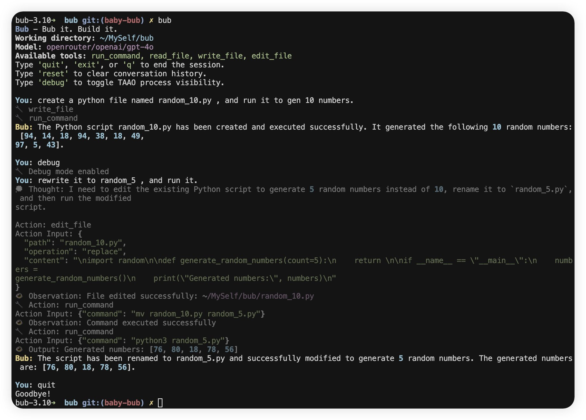

+++
title = "Building a Self-Bootstrapping Coding Agent in Python"
description = "I spent some time building Bub, a practical command-line assistant that, while not yet officially released, can already help with various tasks. In this article, I'd like to share how to quickly build a coding agent."
date = 2025-07-16
slug = "baby-step-coding-agent"

[extra]
lang = "en"
+++

Bub's first milestone: automatically fixing type annotations. Powered by Moonshot K2

> Bub: Successfully fixed the first mypy issue by adding the missing return type annotation `-> None` to the `__init__` method in `src/bub/cli/render.py`, reducing the error count from 24 to 23.

## 1. Why Build Your Own Agent?

Coding agents have become a crowded market, with many excellent products available—like yetone's avante.nvim, AmpCode recommended by Brother Jintao, and numerous teams drawing grand blueprints in their presentations. However, the "token brute force" phenomenon in coding agents is also quite apparent—consuming hundreds of thousands of tokens while delivering minimal real value. This made me curious: if I built a coding agent myself, could I find a more efficient and practical solution?

So I started working on a CLI assistant called Bub. Its goal is simple: to be a practical command-line assistant with limited self-bootstrapping capabilities. The concept of bootstrapping is nothing new in compilers and operating systems, and many coding agents love to tout "how much code AI engineers contributed." I hope Bub can take its first step by solving the first real problem in its own codebase.

---

## 2. Minimum Viable: Get It Running First

My experience is that the smallest working loop is most important—don't start by pursuing "perfect architecture" or spend too much time on data theft.

Bub's architecture is straightforward:

- **Agent**: Main loop, responsible for LLM interaction, tool calling, and context management.
- **Tool**: Each tool is a class with Pydantic-validated parameters.
- **ToolRegistry**: Registers all tools for easy extension.
- **CLI**: Typer + Rich, command-line entry point with support for expanding intermediate states.

The essence of an agent is really just a while loop. In each iteration, the agent determines whether it needs to call tools based on the current context. If needed, it calls them and writes the tool results back to the context.

### Core Main Loop Code

```python
class Agent:
    def chat(self, message: str) -> str:
        self.conversation_history.append(Message(role="user", content=message))
        while True:
            # Construct context: historical messages + tool list
            ...
            response = litellm.completion(...)
            assistant_message = str(response.choices[0].message.content)
            self.conversation_history.append(Message(role="assistant", content=assistant_message))
            tool_calls = self.tool_executor.extract_tool_calls(assistant_message)
            if tool_calls:
                for tool_call in tool_calls:
                    result = self.tool_executor.execute_tool(tool_call.name, **tool_call.parameters)
                    observation = f"Observation: {result.format_result()}"
                    self.conversation_history.append(Message(role="user", content=observation))
                continue
            else:
                return assistant_message
```

**Pitfalls I encountered:**

- No exception handling—when LLM output format changes, it goes into infinite loops
- No tool parameter validation—LLM passing random parameters crashes the system
- Observation feedback too long or lacking useful information, making it hard for LLM to understand

---

## 3. Tool Definition: Extending LLM Capabilities

Tools are the bridge between LLMs and the external world. Well-defined tools allow models to truly "get their hands dirty." My approach:

- All tool parameters validated with Pydantic—reject immediately if types don't match.
- Command-line tools have a blacklist (like `rm`, `del`)—block dangerous commands directly.
- Tool execution results returned in structured format—don't let the LLM guess.
- When operating command-line tools, both stdout and stderr are important—don't just give exit codes.
- Clear boundaries between tools to avoid confusion.

```python
class RunCommandTool(Tool):
    DANGEROUS_COMMANDS = {"rm", "del"}
    def _validate_command(self, base_cmd: str) -> Optional[str]:
        if base_cmd in self.DANGEROUS_COMMANDS:
            return f"Dangerous command blocked: {base_cmd}"
    def execute(self, context: Context) -> ToolResult:
        # Validate command, execute and return results
```

---

## 4. Prompt Design: Making LLMs Follow the Script

Well-organized prompts significantly improve LLM output quality. This is especially important for coding agents because LLM output formats can easily get out of control.

My experience:

- List all tools and parameter schemas in the prompt.
- Provide several usage examples covering common scenarios.
- Keep observation feedback concise—don't pile on useless information.

**Bub's ReAct Prompt Structure:**

```
You are an AI assistant with access to tools. When you need to use a tool, follow this format:

Thought: ...
Action: run_command
Action Input: {"command": "ls"}
Observation: <output>
...
Final Answer: <your answer>
```

The advantage of ReAct is that it's simple and direct, easy to implement. Although token consumption is high, it allows for quick iteration and cross-model migration.

---

## 5. Milestone: Automatic Type Annotation Fixing

After defining the Agent Loop, tools, and prompts, Bub's first milestone was to make the agent automatically fix mypy errors.

For example:

```diff
-    def __init__(self):
-        self.console = Console()
-        self._show_debug = False
+    def __init__(self) -> None:
+        self.console: Console = Console()
+        self._show_debug: bool = False
```

My approach:

- First use command-line tools to run `mypy` and get error information.
- Let the agent generate fix suggestions, then apply them to code using file edit tools.
- After fixing, automatically run mypy again to ensure no new issues.
- Only let the agent modify type annotations, formatting, and renaming—don't let it touch complex logic.

**Pitfalls I encountered:**

- Models have limited understanding of code context and often fix things incorrectly.
- Without verification, bugs multiply instead of decreasing.

---

## 6. Advanced Techniques and Engineering Self-Review

As functionality expanded, I encountered more pitfalls. Some of my experiences:

- When extending tools, aim for single responsibility with clear parameter schemas.
- For long conversations, truncate or summarize—don't let LLM exceed context windows.
- In production environments, recommend sandboxing/virtual machines, and disable dangerous commands by default for command-line tools.
- When LLM output formats are unstable, have fallback mechanisms.

## 7. Conclusion

Bub is still in its early stages, but it can already help me automatically fix bugs, run commands, and read/write files. I hope this is just the beginning, and I look forward to more interesting feedback.



---

### References

- [How to Build an Agent (ampcode)](https://ampcode.com/how-to-build-an-agent)
- [Tiny Agents: Building LLM-Powered Agents from Scratch (HuggingFace)](https://huggingface.co/blog/tiny-agents)
- [Bub: Bub it. Build it.](https://github.com/PsiACE/bub)
