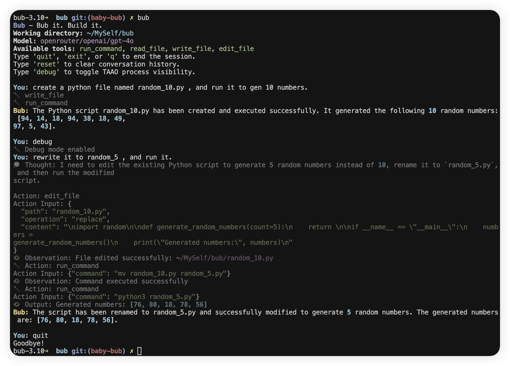

+++
title = "Baby Steps: 用 Python 实现一个能自举的 Coding Agent"
description = "从一个 while 循环开始，让智能体先学会修自己的项目。"
date = 2025-07-16
slug = "baby-step-coding-agent"

[extra]
lang = "zh"
+++

Bub 的第一个 milestone：自动修类型注解。由 Moonshot K2 驱动

> **Bub:** Successfully fixed the first mypy issue by adding the missing return type annotation `-> None` to the `__init__` method in `src/bub/cli/render.py`, reducing the error count from 24 to 23.

## 1. 为什么要自己造 Agent？

Coding Agent 现在已经是个红海赛道，市面上有不少优秀的产品，比如 yetone 的 avante.nvim、晋涛哥哥推荐的 AmpCode，还有许多团队在 PPT 中绘制宏伟蓝图。然而，Coding Agent 的“token 大力出奇迹”现象也很明显——动辄几十万 token 的消耗，真正有价值的部分却少之又少。这让我很好奇：如果自己动手造一个 Coding Agent，能不能找到更高效、更实用的解决方案？

于是，我开始折腾一个叫 Bub 的 CLI 助手。它的目标很简单：做一个命令行下的实用助手，同时具备有限的自举能力。自举这个概念在编译器、操作系统领域早已不算新鲜，很多 Coding Agent 也喜欢宣传“AI 工程师贡献了多少代码”。我希望 Bub 能迈出自己的第一步，解决它自身代码中的第一个实际问题。

---

## 2. 最小可用：先跑起来再说

我的经验是，能跑起来的最小闭环最重要，别一上来就追求“完美架构”或者花太多时间做数据小偷。

Bub 的分层很简单：
- **Agent**：主循环，负责 LLM 交互、工具调用、上下文管理。
- **Tool**：每个工具一个类，参数用 Pydantic 校验。
- **ToolRegistry**：注册所有工具，方便扩展。
- **CLI**：Typer + Rich，命令行入口，支持展开中间状态。

Agent 的本质其实就是一个 while 循环。每次循环，Agent 会根据当前上下文判断是否需要调用工具，如果需要就调用，然后把工具的返回结果写回上下文。

### 主循环核心代码

```python
class Agent:
    def chat(self, message: str) -> str:
        self.conversation_history.append(Message(role="user", content=message))
        while True:
            # 构造上下文，历史消息+工具列表
            ...
            response = litellm.completion(...)
            assistant_message = str(response.choices[0].message.content)
            self.conversation_history.append(Message(role="assistant", content=assistant_message))
            tool_calls = self.tool_executor.extract_tool_calls(assistant_message)
            if tool_calls:
                for tool_call in tool_calls:
                    result = self.tool_executor.execute_tool(tool_call.name, **tool_call.parameters)
                    observation = f"Observation: {result.format_result()}"
                    self.conversation_history.append(Message(role="user", content=observation))
                continue
            else:
                return assistant_message
```

**踩过的坑：**
- 没有捕获，LLM 输出格式一变就死循环
- 工具参数没校验，LLM 乱传参数直接崩
- Observation 反馈太长或缺乏有效信息，LLM 理解困难

---

## 3. 工具定义：扩展 LLM 的能力

工具是 LLM 和外部世界的桥梁，定义得好，模型才能真正“动手”。我的做法是：
- 工具参数全部用 Pydantic 校验，类型不对直接拒绝。
- 命令行工具有黑名单（比如 `rm`、`del`），遇到危险命令直接报错。
- 工具执行结果结构化返回，别让 LLM 猜。
- 操作命令行工具时，stdout 和 stderr 都很重要，不能只给 exit code。
- 工具之间要有明确边界，避免混淆。

```python
class RunCommandTool(Tool):
    DANGEROUS_COMMANDS = {"rm", "del"}
    def _validate_command(self, base_cmd: str) -> Optional[str]:
        if base_cmd in self.DANGEROUS_COMMANDS:
            return f"Dangerous command blocked: {base_cmd}"
    def execute(self, context: Context) -> ToolResult:
        # 校验命令，执行并返回结果
```

---

## 4. Prompt 设计：让 LLM 按套路出牌

组织良好的提示词能显著提升 LLM 的输出质量。对于 Coding Agent 来说尤其重要，因为 LLM 的输出格式很容易失控。

我的经验：
- Prompt 里要列出所有工具和参数 schema。
- 多给几个调用示例，覆盖常见用法。
- Observation 反馈要简洁，别堆无用信息。

**Bub 的 ReAct Prompt 结构：**

```text
You are an AI assistant with access to tools. When you need to use a tool, follow this format:

Thought: ...
Action: run_command
Action Input: {"command": "ls"}
Observation: <output>
...
Final Answer: <your answer>
```

ReAct 的好处是简单直接，容易落地，虽然 token 消耗大，但能快速试错、跨模型迁移。

---

## 5. milestone：自动修类型注解

定义好 Agent Loop、工具和 Prompt 后，Bub 的第一个 milestone 就是自动修复了一个 mypy 报错。

比如：

```diff
-    def __init__(self):
-        self.console = Console()
-        self._show_debug = False
+    def __init__(self) -> None:
+        self.console: Console = Console()
+        self._show_debug: bool = False
```

实际的 Agent Loop：
- 只让 agent 改类型注解、格式化、重命名，别让它碰复杂逻辑。
- 先用命令行工具执行 `mypy`，拿到报错信息。
- 让 agent 生成修复建议，再用 file edit 工具应用到代码。
- 修完自动再跑一次 mypy，确保没新问题。

**踩过的坑：**
- 模型对代码上下文理解有限，经常修错。
- 不验证，bug 越修越多。

---

## 6. 进阶玩法与工程自查

随着功能扩展，踩的坑也越来越多。我的一些经验：
- 工具扩展时，建议单一职责，参数 schema 明确。
- 长对话要截断或摘要，别让 LLM 超窗。
- 生产环境建议沙箱/虚拟机，命令行工具默认禁危险命令。
- LLM 输出格式不稳时要有 fallback 兜底。

## 7. 总结

Bub 还在早期，但已经能帮我自动修 bug、跑命令、读写文件。我希望这只是一个开始，然后得到更多有意思的反馈。




---

### 参考资料

- [How to Build an Agent (ampcode)](https://ampcode.com/how-to-build-an-agent)
- [Tiny Agents: Building LLM-Powered Agents from Scratch (HuggingFace)](https://huggingface.co/blog/tiny-agents)
- [Bub: Bub it. Build it.](https://github.com/PsiACE/bub)
