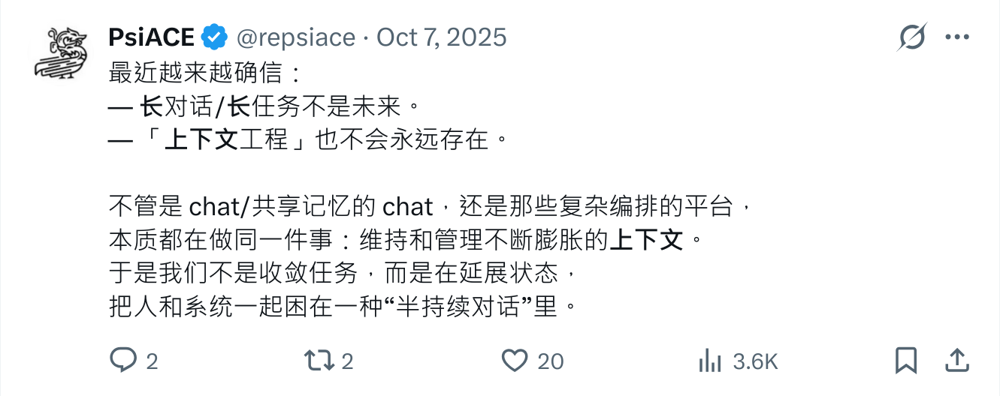

+++
title = "被缚的普罗米修斯"
description = "从会话、Memory 到上下文：更少假设，更多构造。"
date = 2026-02-16
slug = "prometheus-bound"

[taxonomies]
tags = ["agent", "session", "memory", "context", "architecture", "bub"]

[extra]
lang = "zh"
+++

> 谨以此文，献给 bub ，和我的朋友们。

在刚刚过去的一周里，我们在 bub 上第一次验证了此前关于打孔纸带与锚点的想法，赞美明哥哥，我想大家也可以去读他写的那篇《创造一只龙虾，需要些什么?》。

回到这篇文章，我想讨论另外一个话题，会话、Memory 和上下文对模型或者 Agent 意味着什么。

> 在希腊神话里，普罗米修斯把火带给人类，随后被锁在高加索山上，日复一日地承受惩罚。

我想这代表了一种现实隐喻。

---

## 会话，一个具体问题

过去几年在 chatbot 的视角下，会话是任务切换的关键要素，于是会话之间存在着隔离，即便是 openclaw 大行其道的今天，仍然深受其影响：

> 疑问：当用户说“换个话题/从头开始”时，进程启动时 session 已固定，模型在这一轮里再切 symlink 只能影响下一轮。你在文章的 AI-native 设想里，通常怎么让“这一条消息”就从新 session 开始？群聊里经常多话题并行，你更推荐的 session 组织方式是什么？

(前情提要，bub 从最开始就是在群聊中成长的，我管这个叫社会化评估，这是一种更为聪明的方式，如果有机会我会继续讲讲这个话题。)

会话是一种硬隔离的形式，这意味着会话与会话之间是没有感知的，会话只能不断向前，直到任务完成或者感到厌烦，但是上下文的长度是有限的。

过去我们会看到几种不同的会话模式：

- 为了允许会话能够支持更长的上下文，诞生了 compact、summary 。
- 为了允许会话之间共享相同的祖先和孙代，诞生了 fork 和 merge 。
- 为了减少前两者的复杂性，诞生了 handoff 。当然，打孔纸带和锚点也深受其影响。

前面的几种方式只解决同一会话的问题，如果遇到跨会话应该怎么办？

## Memory ，失败的实验品

尽管 Memory 在过去一年内非常火爆，甚至我有不少好友、同事在上面投入了不少经验，但我对 Memory 的评价就像标题那样。

Memory 解决的主要是生成的一致性问题，大致可以分为两类：

- 如果会话在同一个系统里展开，如何保持一致性。
- 如果会话在不同系统中展开，如何保持一致性。

让我们看看一个常规的 Memory 系统应该如何工作：

- 当用户发生会话，相关的语料和偏好会被模型提取，路由到 Memory 旁路进行查询。
- 考虑到用户问题的相关性和上下文窗口，进行排序和删减工作。填充到生成使用的模板中。
- 利用模板指导模型的生成动作。

开销是一个确定性的动作，大多数 Memory 系统会声称通过引入一个更轻量的小模型或者前后置步骤大幅减少 token 开销和推理时间（比如，一个典型的做法是放弃 Memory 项背后关联的事实），并且取得足够高质量的效果。

但是值得我们关注的其实是另外一个问题，一致性并不是免费的：

- 提取是一个失真的过程，而且我们要求模型深入地参与它。如果你批评过模型的幻觉，是什么让你接受提取这个过程。
- 用户的偏好是广泛的，而且并非一成不变，在校准这件事情上的投入会远远超过想像。如果你曾经了解知识图谱或者 GraphRAG ，应该是可以轻松预见这一切。
- 大多数 Memory Less 方案（比如基于 Markdown 的方案），本质是 Embedding Less 方案，它仍然无法解决失真和更换模型后的漂移问题。
- 作为一个旁路，它的失败不应该影响系统行为。所以你可能无法得到预期的一致性。

过去减少的 token 和时间的开销，会不会在某个时间节点再回来。Memory 看起来困难重重，那么上下文呢，会是另一条光明的道路吗？

## Context ，另一个糖衣炮弹

在上下文工程的既定语境里，它包罗万象，这里面存在前面提到的会话和 Memory，外部的 RAG 系统，互联网上的即时查询，和各种业务系统的知识。

我甚至很难想像会看到一个确切无法装入箩筐的事物，所以我们可以简单地认为，上下文在这个语境是一定会不断膨胀的，直到它超过某个确定的窗口限制。这也是大多数人执迷上下文管理的开始，通过截断、增加各种检索的限制，通过人为编码的设置，试图找到一个相对足够大和优质的上下文来解决问题。

我想举两个反例：

- 在一个知名的模型长上下文能力测评中，除了 gpt 系列之外，绝大多数模型在上下文增长的过程中出现了生成质量的断崖式衰退。而每个模型的能力边界不同，意味着上下文管理很难直接适应所有模型和 Agent 系统。
- 另一个例子是“龙虾攻打月球”，有 Kimi 的工作人员表示用户应该利用缓存的机制来设计龙虾，并且尽量避开某一些时段以释放负载。上下文管理的复杂度意味着这个要求几乎是无厘头的，我甚至会批判这是一种偷懒行为。

抽象泄漏是严重的系统设计问题，当利用某些既定的上下文管理机制处理这一切时，也意味着会存在足够多的手段打破系统的可靠性。

## 更聪明和更少假设

bub 的设计最开始就没有考虑 “持续对话系统” ，我们考虑它在一个足够长的上下文上工作，也就是无尽的纸带。它在第一天就需要面临群聊中的社会化任务。问题不断出现，任务不断形成，又不断结束。在这样一个多样和复杂的场景中，每一轮对话都可能面临一个新的目标，它没有也无法要求存在某个永远延续的状态，甚至不存在必须继承的对话祖先。

回过头来看那个曾经让我害怕创造的想法，一条无尽的打孔纸带和上面的锚点，它在 bub 上运作良好，在越过上下文边界或者系统故障时，让我们有机会拥有足够简单和可靠的修复手段。

但是在现实任务之中，并不存在打孔纸带，也不会真的存在一个里程碑上的锚点。重点在于一个动作：构造，而不是继承。当一个任务出现，作为人类的我们也并不是把所有历史压进窗口里，而是做两件事——探索与选择。

- 探索可能包括历史记录、外部系统、Memory、甚至即时查询。
- 选择则意味着丢弃大部分无关内容，只保留最小充分的材料。

上下文工程默认的是递增，是延展，是管理膨胀。它假设状态必须被维护，于是引入缓存、提取、合并、压缩、分叉。每一层机制都在试图修补同一个前提：历史不能丢。但事实是它们无法携带足够多的历史。

bub 的实践给了我一个更简单的答案 —— 历史可以丢。更准确地说，历史不必默认继承。它只是素材库。需要时查询，不需要时忽略。

tape 的意义也在这里。它不是为了记录一切，而是为了允许“按需读取”。它把状态从“持续负担”变成“可选资源”。当上下文不再是递增函数，缓存就只是优化，而不是生命线；Memory 只是索引，而不是人格；会话只是边界，而不是身份。

所谓更聪明，不是引入更多机制。而是减少假设。

## 大道至简

写下“被缚的普罗米修斯”这个标题时，我以为自己在批判一种束缚。

我们总是习惯用隐喻，把模型想象成被压抑的火种，被工程系统限制的力量。但也许问题没有那么戏剧化。模型并没有被囚禁。它只是被我们误用在一种错误的组织方式里。

任务出现，构造上下文，完成任务，结束。
下一轮重新开始。
当我们停止把系统建立在“延续状态”之上，很多复杂度会自然消失。

如果系统足够清晰，就不需要神话。
也不需要普罗米修斯。

---

当然，每一种系统的出现，都意味着有依赖它所解决的问题存在，为了抒发观点，本文做了大量的批判，不代表它们是没有意义的。

另外再次感谢 bub 和我的朋友们，让我有机会更深刻地感受和表达这一切。

## 推荐阅读

- [创造一只龙虾，需要些什么?](https://frostming.com/posts/2026/create-a-claw/)
- [重新发明打孔纸带](https://psiace.me/zh/posts/reinvent-the-punch-tape/)
- [bub](https://github.com/psiace/bub)
- [AI Programming Is a New Framework](https://www.piglei.com/articles/ai-programming-is-a-new-framework/)
