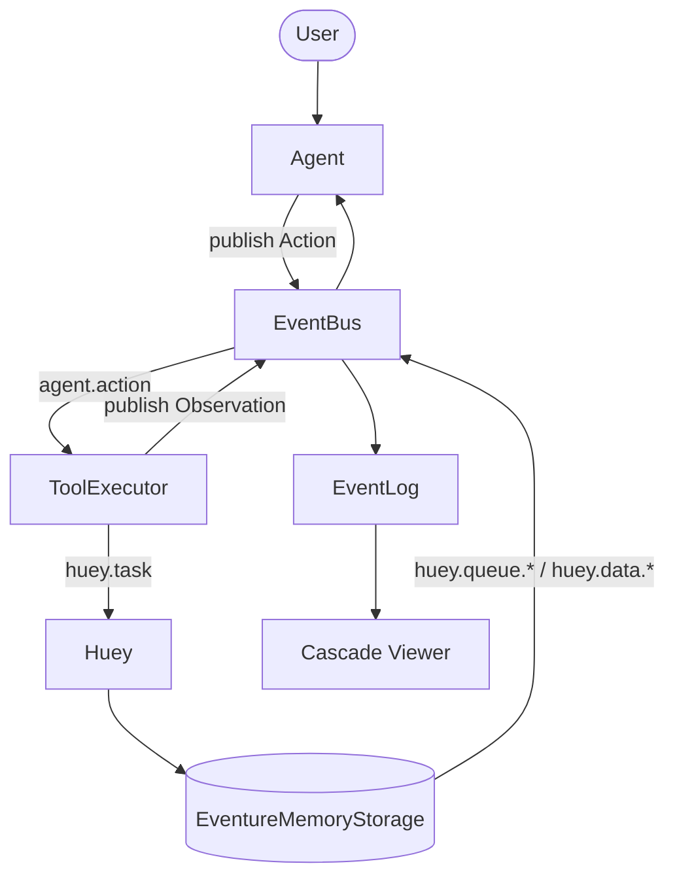

# Agent Has No Secret

A pragmatic, single-file agent that shows the essence: events + queue + CRUD, with a model as a collaborator.

What you’ll see on screen (in one terminal):

- Live event stream: every `agent.*` and `huey.*` event is printed with clear styling
- ReACT loop: Thought → Action → Action Input → Observation → Final Answer
- A tree-shaped Cascade Viewer that groups events by tick and shows parent-child causality

Key components

- Eventure EventBus: a shared bus. Agent, ToolExecutor, and Storage all publish to the same bus
- Huey: `@huey.task()` executes tools. We run in immediate mode (synchronous), no extra processes
- Eventure EventLog: records queue ops (enqueue/dequeue/flush) and data-store ops (put/peek/pop/flush_results)
- Tools: `echo`, `time`, `http_get` (descriptions come from each tool’s `__doc__`; JSON schema is injected into system prompt)
- Model client: OpenAI Python client, preferring OpenRouter via `base_url` + `OPENROUTER_API_KEY`

Why this matters

- Agents are just good engineering: clear events, queues, CRUD boundaries, plus a model
- A shared EventBus unifies intent (Action), execution (Huey), and state change (Observation)
- Causality and time: each user round advances a tick; Observation advances tick again. Cascade makes reasoning visible

## Prerequisites

- Python 3.10+
- Either an OpenRouter API key or an OpenAI API key

## Setup (OpenRouter recommended)

```bash
python -m venv .venv
source .venv/bin/activate  # Windows: .venv\Scripts\activate
pip install -r requirements.txt

# OpenRouter (recommended)
export OPENROUTER_API_KEY=sk-or-v1-...
# optional base URL (defaults to https://openrouter.ai/api/v1)
# export OPENROUTER_BASE_URL=https://openrouter.ai/api/v1
# optional model (defaults to openrouter/auto)
# export OPENROUTER_MODEL=openrouter/auto

# or copy .env.example to .env and populate keys
```

OpenAI fallback

```bash
export OPENAI_API_KEY=sk-...
# optional model (defaults to gpt-4o-mini)
# export OPENAI_MODEL=gpt-4o-mini
```

## Run

```bash
python agent_has_no_secret.py
```

You should see:

- Colored events streaming in real time
- A green “Final Answer” panel
- A “Cascade Viewer” section with a per-tick, hierarchical tree

## Diagram



## Minimal Code Skeletons

Event-driven storage wrapper

```python
class EventureMemoryStorage(MemoryStorage):
    def __init__(self, event_bus: EventBus):
        super().__init__("huey")
        self.bus = event_bus
    def enqueue(self, data, priority=None):
        super().enqueue(data, priority=priority)
        self.bus.publish("huey.queue.enqueue", {"data": data, "priority": priority})
```

Tool with self-description and schema

```python
def tool_http_get(params: dict) -> dict:
    """HTTP GET a URL with optional headers and timeout.
    Args: {"url": string, "timeout"?: number, "headers"?: object}
    Returns: {"ok": boolean, "status"?: number, "headers"?: object, "text"?: string}
    """
    ...
```

ReACT loop (core idea)

```python
while True:
    resp = client.chat.completions.create(model=model, messages=history)
    assistant = resp.choices[0].message.content or ""
    tool_call = extract(assistant)
    if tool_call:
        action_id = uuid4()
        bus.publish("agent.action", {"id": action_id, **tool_call})
        # wait for observation by id, then append Observation to history
        continue
    else:
        return assistant
```

## Design notes

- Shared EventBus: one bus for Agent, ToolExecutor, Storage. Everything is observable
- Immediate mode: simpler for a single-terminal demo; switching to a consumer later is trivial
- ReACT stability: strict format + few-shots; empty/invalid outputs get one gentle nudge
- Causality: parent_event links `agent.action` → huey.\* → `agent.observation` in the cascade

## Troubleshooting

- No output? Check `.env` and that your terminal is in this folder
- HTTP timeouts? Run again or change the URL; the demo is network-dependent
- Too noisy? Comment out `bus.subscribe("*")` in `main`

## Files

- `agent_has_no_secret.py`: single-file demo (Eventure + Huey + OpenAI client with OpenRouter/OpenAI)
- `.env.example`: environment template
