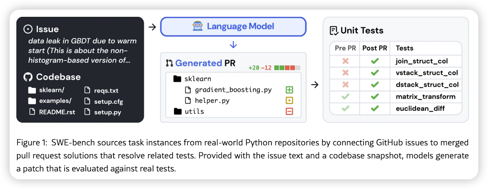
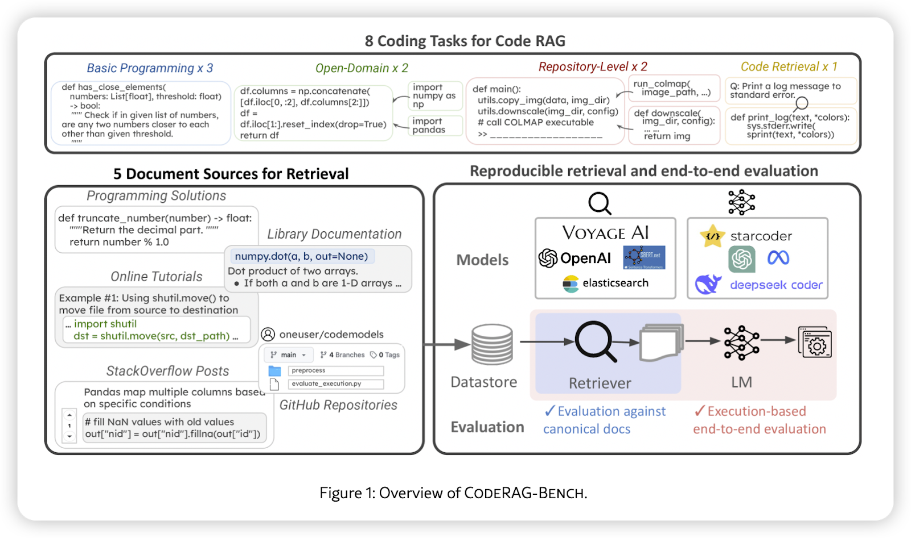
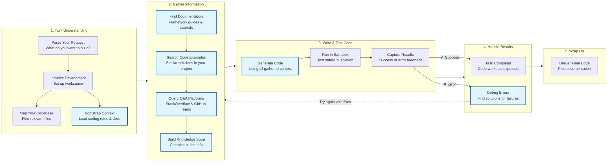
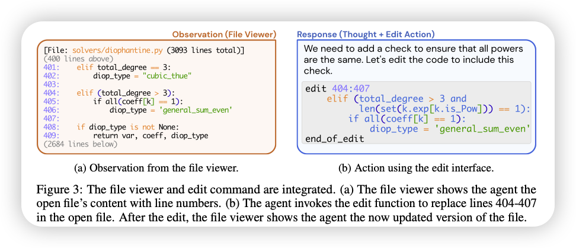

Programming can be tough. Whether you're debugging a tricky error, trying to understand a massive codebase, or figuring out how to use a new framework, there's always something that slows you down. Wouldn't it be great if there was a tool that could help you with all of this—something that could act like a super-smart assistant, guiding you through the process?

That's where **RAG** (Retrieval-Augmented Generation) comes in. It's a fancy name for a simple idea: combining the ability to look things up (retrieval) with the ability to create new solutions (generation). In this article, we'll break down how RAG works, why it's useful for coding assistants, and how it can make your life as a developer easier.

---

## What is RAG?

Imagine you're trying to write code for a feature you've never built before. You might:

- Look up examples online.
- Read the documentation for the framework you're using.
- Search through your codebase for similar functionality.
- Check StackOverflow for solutions to common problems.

RAG does all of this for you, automatically. It's like having a supercharged search engine that not only finds the information you need but also uses it to help you write code. Here's how it works:

1. **Retrieval**: It finds relevant information—like code snippets, documentation, or answers from Q&A sites.
2. **Generation**: It uses that information to create something new, like a piece of code or a solution to a problem.

By combining these two steps, RAG makes coding assistants smarter and more helpful.

---

## Why Do We Need Coding Assistants?

Let's face it: programming isn't just about writing code. A lot of your time is spent on things like:

- Figuring out how existing code works.
- Searching for the right file or module in a huge codebase.
- Debugging errors and trying to understand cryptic error messages.
- Learning new tools, frameworks, or libraries.

These tasks can be frustrating and time-consuming. Coding assistants aim to take care of the boring, repetitive stuff so you can focus on the creative parts of programming. But to do this well, they need to be smart enough to understand your code, find the right information, and even help you fix mistakes. That's where RAG comes in.

---

## How Does RAG Help Coding Assistants?

RAG can make coding assistants better at handling the most common challenges developers face.

Here are a few examples:

### 1. **Understanding Your Task**

Let's say you tell the assistant: "I need to add user authentication to my API." The assistant needs to figure out:

- What kind of authentication you want (e.g., JWT, OAuth).
- Which parts of your codebase are relevant.
- What libraries or frameworks you're using.

RAG helps by retrieving documentation, code examples, and related information to build a clear picture of what you're asking for.

### 2. **Finding the Right Files**

If you're working on a big project, finding the right file or module can feel like searching for a needle in a haystack. RAG can analyze your codebase and quickly point you to the files that matter. For example:

- "Where is the login functionality implemented?"
- "Which module handles database connections?"

By mapping out your codebase, RAG makes navigation much easier.

### 3. **Writing Code**

Once the assistant understands your task, it can use RAG to generate code that fits your needs. For example:

- "Add JWT authentication to my API."
- "Write a function to validate user input."

RAG pulls in examples, documentation, and best practices to make sure the generated code is accurate and useful.

### 4. **Debugging Errors**

When something goes wrong, RAG can help you figure out what happened. It can:

- Analyze error messages and logs.
- Search Q&A platforms like StackOverflow for similar issues.
- Suggest fixes based on what it finds.

This saves you from spending hours Googling error codes and trying random solutions.

---

## The Biggest Challenge: When to Retrieve?

One tricky part of using RAG is deciding **when to look things up**. If the assistant retrieves information too early, it might miss important context. If it waits too long, it might slow down the process. The key is to strike a balance:

- Retrieve early for general knowledge, like framework documentation or coding rules.
- Retrieve on-demand for specific problems, like debugging an error or answering a user query.

This dynamic approach ensures the assistant is both fast and accurate.

---

## Common Misunderstandings About RAG

Some people think RAG is just about using fancy AI models to search for information. But it's more than that. RAG isn't just about finding stuff—it's about combining different types of knowledge to solve problems. For example:

- It can use APIs to query Q&A platforms like StackOverflow.
- It can analyze runtime logs to figure out what went wrong during execution.
- It can pull together code snippets, documentation, and examples to create a complete solution.

RAG is like having a super-organized assistant who knows where to look and how to combine information to help you.

---

## How to Build a RAG-Enhanced Coding Workflow

Here's a simple step-by-step process for how RAG can be used in a coding assistant:

### 1. **Understanding What You Want**

The assistant starts by figuring out exactly what you're trying to accomplish. Let's say you tell it: "I need to add user authentication to my API." It needs to understand:

- What type of authentication you want (JWT tokens? OAuth? Simple passwords?)
- Which parts of your existing code are relevant
- What frameworks and libraries you're already using

This is where RAG kicks in—it retrieves documentation and examples to build a clear picture of your request.

### 2. **Gathering All the Pieces**

Now comes the information-gathering phase. The assistant acts like a super-efficient researcher, pulling together:

- **Documentation**: Official guides for the frameworks you're using
- **Code snippets**: Similar functionality from your project or other open-source projects
- **Q&A knowledge**: Solutions from StackOverflow, GitHub discussions, and other developer communities
- **Best practices**: Coding standards and security guidelines

All of this gets combined into what we call a "knowledge soup"—a rich mix of information that gives the assistant everything it needs to help you.

### 3. **Writing and Testing the Code**

With all that context in hand, the assistant can now generate code that actually makes sense for your specific situation. But it doesn't stop there—it runs the code in a safe sandbox environment to make sure it works. This is crucial because:

- It catches errors before they hit your main codebase
- It validates that the solution actually solves your problem
- It provides immediate feedback for refinement

### 4. **Learning from Success and Failure**

Here's where RAG really shines. If the code works perfectly, great! But if something goes wrong, the assistant doesn't give up. Instead, it:

- Analyzes the error messages and logs
- Searches for solutions to similar problems
- Retrieves additional context that might help fix the issue
- Tries again with the new information

This feedback loop is what makes RAG-powered assistants so much more reliable than simple code generators.

### 5. **Delivering the Final Solution**

Once everything is working, the assistant packages up the solution for you—not just the code, but also documentation explaining how it works and how to maintain it.

---

## Balancing Long-Term and Short-Term Knowledge

Not all information is equally important. Some things need to be stored for long-term use (like framework rules), while others are only relevant for the current task (like runtime logs).

Here's how RAG handles this:

| **Type of Knowledge**     | **How It's Stored**       | **How It's Retrieved**                  |
| ------------------------- | ------------------------- | --------------------------------------- |
| Predefined Rules          | Stored permanently        | Quick lookup via a knowledge graph      |
| Documentation & Tutorials | Stored with versioning    | Semantic search for relevant sections   |
| Q&A Platforms & Codebases | Temporary -> Permanent    | API queries + caching for reuse         |
| Runtime Feedback          | Temporary (task-specific) | Immediate retrieval and dynamic updates |

This balance ensures the assistant is efficient and adaptable.

---

## A Simple Way to Get Started

If you're curious about building a coding assistant but don't want to dive into complex AI systems, here's a lightweight approach:

1. Use predefined rules and prompts to guide the assistant.
2. Retrieve documentation using local tools or web searches.
3. Query Q&A platforms manually or with simple scripts.
4. Capture runtime feedback using basic tools like `grep` or `lint`.

This setup covers the basics of a coding assistant and gives you a foundation to build on.

---

## Final Thoughts

RAG is changing the way we approach programming. By combining retrieval and generation, it enables coding assistants to understand tasks, navigate codebases, write solutions, and debug errors—all while adapting to your needs. Whether you're a beginner or an experienced developer, tools powered by RAG can make your workflow faster and less frustrating.

If you're interested in building your own coding assistant or just want to learn more, start small and experiment. The possibilities are endless, and the best way to learn is by trying things out. Who knows? You might just create the next big thing in developer tools!

---

## References

- https://arxiv.org/html/2310.06770v3
- https://arxiv.org/pdf/2405.15793
- https://arxiv.org/html/2406.14497v1
- https://arxiv.org/html/2402.12317v2
- https://github.com/antvis/GPT-Vis
- https://www.phontron.com/slides/neubig24softwareagents.pdf
