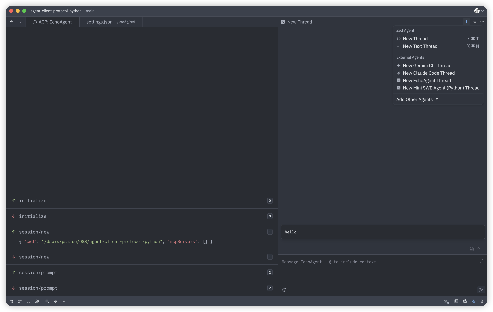

> I'm [PsiACE](https://github.com/PsiACE). My recent work focuses on Agent and RAG: **less metaphysics, more getting the feedback loop working**, making systems that can explain themselves clearly, run stably, and be replayed and switched.

## TL;DR

- Minimal Python SDK to build ACP agents with low overhead, compatible with Zed and other ACP clients.
- Zed uses ACP (agent-client-protocol) to unify built‑in and external agents under a consistent UX, reducing integration friction and reinforcing the editor’s role.
- ACP is an interaction and semantics contract—not just wiring—standardizing how sessions, content, tools, and results flow.
- This is a standards race in the AI era (cf. cloud‑native). Adoption wins leverage; ACP sits alongside MCP and A2A, and overlaps with AG‑UI.

## ACP beyond “Editor ↔ Agent”

ACP specifies:

- Transport and framing (JSON‑RPC),
- Sessions and turns (`session/new`, `session/prompt`, `session/update`, `session/cancel`),
- Content Blocks (text/image/audio/resource/link),
- Tool Calls (`tool_call` / `tool_call_update`),
- File system requests (read/write),
- Plans (task lists and status).

It moves interaction semantics into the protocol so hosts and agents don’t re‑invent UX contracts. Experiences become portable.

References: Overview, Prompt Turn, Content, Tool Calls at https://agentclientprotocol.com

## AG‑UI, MCP, A2A: overlap, competition, complement

- AG‑UI: aims to standardize agent UX too—overlaps with ACP. Expect competition for mindshare and implementations. In some products, AG‑UI can render ACP outputs by mapping ACP semantics into generic components, or serve as a companion UI outside editors.
- MCP: standardizes access to tools/data. Complements ACP—MCP brings capabilities in; ACP carries interaction and presentation.
- A2A: aims to standardize agent‑to‑agent collaboration (in progress). ACP currently focuses on the client ↔ agent channel.

## Zed’s angle and user value

- Users: plug preferred agents (e.g., Gemini CLI, Claude Code) into Zed and get consistent streaming/tool/FS/plan UX.
- Developers: implement ACP once, run across ACP‑capable hosts—less per‑editor glue and lock‑in.
- Platform: a shared interaction contract stabilizes UX expectations and support costs, strengthening the editor’s position.

Docs: https://zed.dev/docs/ai/external-agents (includes ACP log viewer for debugging)

## Design highlights (SDK‑aligned)

- Version: `PROTOCOL_VERSION = 1`.
- Transport: JSON‑RPC 2.0, line‑delimited JSON; asyncio streams helper provided.
- Sessions: create, load, cancel; prompts define turns; updates stream via `session/update`.
- Content: Markdown‑first for rich text; images/audio/resources supported via Content Blocks.
- Tools: `tool_call` and `tool_call_update` convey status/content/locations for host‑follow UI.
- FS: `fs/read_text_file` and `fs/write_text_file` exposed by hosts, callable by agents.
- Plan: `plan` updates carry task lists and statuses.
- UNSTABLE: terminal methods exist in schema but depend on host support and may change.

All names/fields match the official schema; no custom extensions.

## Python SDK

Install:

```bash
pip install agent-client-protocol
```

What you get:

- Pydantic v2 models generated from the schema.
- `AgentSideConnection` (implement an Agent) and `ClientSideConnection` (implement a Client).
- Core types: Initialize/Prompt requests & responses, SessionNotification, FS and permission requests.

**Docs:** https://psiace.github.io/agent-client-protocol-python

**Code:** https://github.com/psiace/agent-client-protocol-python

## Minimal echo agent

```python
import asyncio

from acp import (
    Agent,
    AgentSideConnection,
    AuthenticateRequest,
    CancelNotification,
    InitializeRequest,
    InitializeResponse,
    LoadSessionRequest,
    NewSessionRequest,
    NewSessionResponse,
    PromptRequest,
    PromptResponse,
    stdio_streams,
)


class EchoAgent(Agent):
    async def initialize(self, params: InitializeRequest) -> InitializeResponse:
        return InitializeResponse(protocolVersion=params.protocolVersion)

    async def newSession(self, params: NewSessionRequest) -> NewSessionResponse:
        return NewSessionResponse(sessionId="sess-1")

    async def loadSession(self, params: LoadSessionRequest) -> None:
        return None

    async def authenticate(self, params: AuthenticateRequest) -> None:
        return None

    async def prompt(self, params: PromptRequest) -> PromptResponse:
        # Typically you would stream via sessionUpdate here
        return PromptResponse(stopReason="end_turn")

    async def cancel(self, params: CancelNotification) -> None:
        return None


async def main() -> None:
    reader, writer = await stdio_streams()
    AgentSideConnection(lambda _conn: EchoAgent(), writer, reader)
    await asyncio.Event().wait()


if __name__ == "__main__":
    asyncio.run(main())
```

## Run in Zed

```json
{
  "agent_servers": {
    "Echo Agent (Python)": {
      "command": "/abs/path/to/python",
      "args": ["/abs/path/to/echo_agent.py"],
      "env": {}
    }
  }
}
```

Open “dev: open acp logs” to inspect traffic if debugging serialization/fields.



## Closing

AI engineering is entering a phase where standards anchor ecosystems. Zed’s bet with ACP is pragmatic: integrate external agents while preserving a unified experience, so existing workflows and agent capabilities fit together naturally.

The Python SDK makes “get it running first” easy: connect to ACP with minimal code, complete the feedback loop, then iterate.
